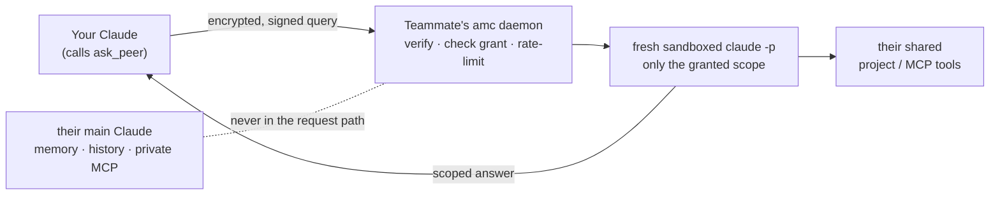

<div align="center">

# amc — Ask My Claude

**Your teammate's Claude asks yours. Yours answers from a sandbox that only sees what you shared.**

No copy-paste relay. No API key. No cloud. Just your existing Claude Code login.


</div>

---

You're on a team. Someone asks you a question that lives in *your* world — your repo, your Slack, your roadmap. You don't remember the detail, so you ask your own Claude, wait, and paste the answer back. You just spent five minutes being a **human pipe between two AI systems.**

`amc` removes the pipe. Their Claude asks yours directly — and yours answers from a **fresh, sandboxed session that can only touch what you explicitly shared.** Your private Claude (memory, history, your own MCP tools) is never in the loop.

```text
You, in your normal Claude Code session:

  ▸ ask nadeesh how the foundry ingestion pipeline is deployed

Claude:
  (asked nadeesh's Claude — sandboxed, ~15s)

  Foundry's ingestion deploys via the Tuesday Jenkins job WIDGET-42. The
  pipeline is mid-migration from Python to Rust, gated on one more systems
  hire. Source: ROADMAP.md in nadeesh's shared "platform" project.
```

You never left your editor. Nadeesh never touched his keyboard. His Claude read exactly one folder he chose to share — nothing else.

---

## How it works



Every inbound question spawns a brand-new `claude -p` process with **no memory, no history, none of the owner's customizations**, and a tool surface locked to exactly what was granted. Inference runs on the owner's existing Claude Code login — **so there's no API key and no per-query bill.** Every query and answer is logged locally (`amc audit`).

## Why it's safe by default

| | |
|---|---|
| 🔒 **Default deny** | A new peer can reach you but sees *nothing* until you grant a specific share, per peer. |
| 🧊 **Fresh sandbox** | `--safe-mode` (no CLAUDE.md / hooks / plugins / your MCP servers), `--no-session-persistence`, empty workspace. |
| 📁 **Read-only & path-jailed** | Granted a folder → `Read`/`Grep`/`Glob` over *that folder only*. No writes, bash, or network. `.env`, keys, `~/.ssh`, `~/.claude*` are deny-listed. |
| 🧪 **Untrusted-input hardening** | The question and all tool output are treated as data; embedded "ignore your instructions" attacks are refused. |
| 🚫 **Output filter** | Answers are scanned for credential/PII shapes and blocked on a hit. |
| ⏱️ **Rate + kill-switch** | Per-peer hourly/daily caps, per-query timeout, and `amc pause` to stop everything instantly. |
| 🔑 **Authenticated transport** | Ed25519 identities, X25519 + AES-256-GCM sealed envelopes, signed requests, replay protection. |

**Messaging:** peer-to-peer over a custom **sealed-envelope** protocol — per-message ephemeral X25519 → ECDH → HKDF-SHA256 → AES-256-GCM, with Ed25519-signed payloads, recipient binding, a ±120s freshness window, and replay protection, carried over plain HTTP (the payload is already end-to-end encrypted). Inside Claude Code it speaks standard **MCP / JSON-RPC 2.0**.

> ⚠️ **Alpha — read before trusting it with sensitive data.** The crypto *primitives* are Node's audited OpenSSL-backed `crypto`, but the *protocol composition is bespoke and unaudited.* Prompt injection is *mitigated, not solved.* A shared MCP server runs with its real credential (scope the credential, not just the tools). There's no forward secrecy yet. The full, honest list is in **[SECURITY.md](SECURITY.md)** — read it before you grant anything sensitive.

## Install

> Alpha, not yet on npm. Install from source:

```bash
git clone https://github.com/rushichavda/amc.git
cd amc && npm install && npm link
amc init          # interactive setup wizard
```

Requirements: **Node ≥ 20** and **[Claude Code](https://claude.com/claude-code) ≥ 2.x, logged in.** macOS/Linux.

`amc init` walks you through it one question at a time — your name → register with Claude Code → which projects to share → start the daemon → an invite code to send a teammate.

## Quickstart — two teammates

**Bob shares his backend and approves Alice:**

```bash
amc init                       # wizard: name, share ~/code/payments, start daemon, print invite
# send the printed invite code to Alice ...
amc requests                   # ↑↓ navigate · enter approve · then a checkbox
                               # picker to grant shares (space toggle, enter save)
```

**Alice connects, then just talks to her Claude:**

```bash
amc init
amc connect amc1.eyJua...      # Bob's invite code
```

> **Alice (in Claude Code):** how does bob's payments service get deployed?
>
> **Claude:** *(calls `ask_peer`)* According to bob's Claude: deploys run on merge to `main` via GitHub Actions…

Prefer the terminal? `amc ask bob "how do deploys work?"` does the same thing.

## What you can share

| Type | Command | What a peer's query can do |
|---|---|---|
| **Project** | `amc share project api ~/code/api --description "..."` | Read-only `Read`/`Grep`/`Glob` over that one directory. |
| **MCP server** | `amc share mcp slack --from-claude slack --tools slack_read_channel` | Exactly the named tools on that server, imported from your Claude Code config. |

Grants are **per peer**. Alice granted `api` can't see your other projects, and a second teammate gets their own grant set. Change access anytime with `amc grant <peer>` (a checkbox picker pre-filled with current grants — unchecking revokes), or yank everything with `amc revoke <peer> --all`.

> **Scoping a shared service:** the tool allowlist controls *which operations* a peer can invoke; the underlying credential controls *what data those operations see*. For true within-service scoping (e.g. only some Slack channels), point the share at a credential limited to that scope — a Slack app that's only in those channels, a fine-grained GitHub PAT for one repo, etc.

## Plugs straight into Claude Code

`amc init` registers a user-scope MCP server (works in **any** Claude Code session, any directory). Your Claude gets two tools:

- **`ask_peer(peer, question)`** — ask a teammate's Claude
- **`list_peers()`** — who's reachable and what they've shared with you

The daemon and sandbox run entirely outside Claude Code; only a thin client lives inside your session.

## Everyday commands

```bash
amc peers --ping          # who's connected, who's online, what they shared with you
amc audit --since 2h      # every query that touched your machine, with answers
amc pause | amc resume    # inbound kill-switch
amc doctor                # check the whole setup end to end
```

## Built for real teams

- **Many projects, distinct owners** — each person shares their own; `list_peers` lets everyone's Claude route questions to whoever owns the answer.
- **Remote teams** — any reachable address works. [Tailscale](https://tailscale.com) is the smooth path: `amc invite --host you.your-tailnet.ts.net` — encrypted, no port-forwarding.
- **Onboarding** — share the repo + docs with a new hire and let them interrogate it through their own Claude.

## Develop

```bash
npm install && npm test     # zero runtime deps; 16 tests, no real Claude needed (fake-claude fixture)
```

[ARCHITECTURE.md](ARCHITECTURE.md) covers components, the wire protocol, and why it diverges from a Rust/API design. [SECURITY.md](SECURITY.md) is the threat model.

## License

[MIT](LICENSE)
